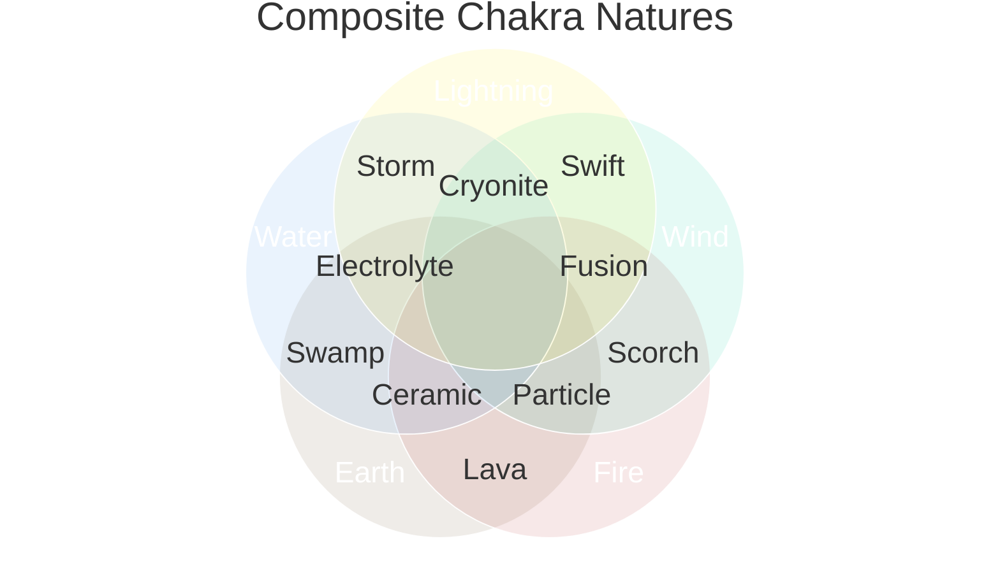
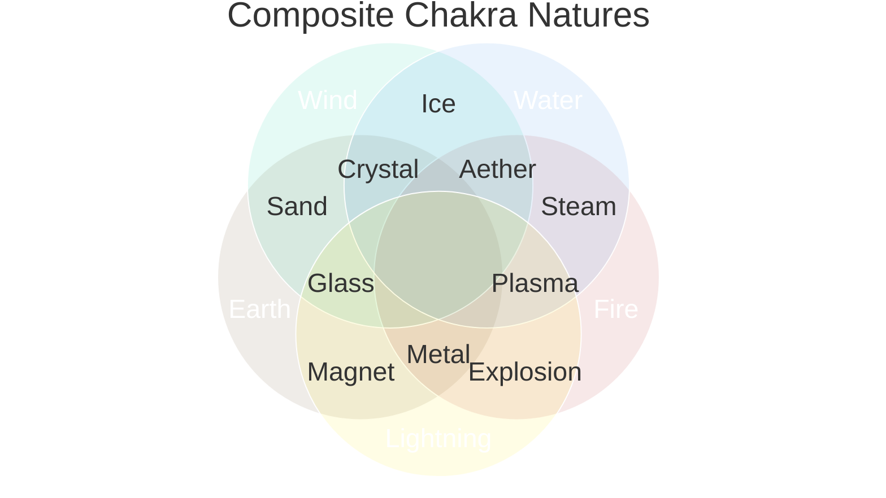

# 複合性質血継 (Fukugō Seishitsu Kekkei) or Composite Nature Bloodline Inheritance(s)
- This refers to the subsection of the Bloodline Inheritances that involve inheriting the low resistance chakra pathways that correspond to the composite or derived chakra natures. ^composite-nature-bloodlines-definition
- The formation of the hierarchy of the composites stems from the number of elements that surround the pathways.
- The first stage is Dual-Natured Composites i.e. **二重性質複合 (_Nijū Seishitsu Fukugō_)**
- The second stage is Tri-Natured Composites i.e. **三重性質複合 (_Sanjuu Seishitsu Fukugō_)**
- The third stage is the Quad-Natured Composites i.e. **四重性質複合 (_Shijū Seishitsu Fukugō_)**
- The fourth stage is the Penta-Natured Composites i.e. **五重性質複合 (_Gojū Seishitsu Fukugō_)**

| Combination | English                        | Japanese                               |
| ----------- | ------------------------------ | -------------------------------------- |
| 2           | **Dual-Nature Composite**      | **二重性質複合** (_Nijū Seishitsu Fukugō_)   |
| 3           | **Triple-Nature Composite**    | **三重性質複合** (_Sanjuu Seishitsu Fukugō_) |
| 4           | **Quadruple-Nature Composite** | **四重性質複合** (_Shijū Seishitsu Fukugō_)  |
| 5           | **Quintuple-Nature Composite** | **五重性質複合** (_Gojū Seishitsu Fukugō_)   |

